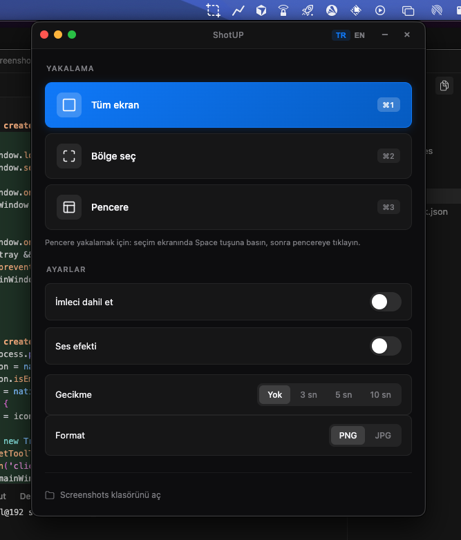

## ShotUP — macOS screenshot app

Minimal, clean and modern Electron screenshot app. **macOS only.**

### Features

- **Menu bar (tray) icon**
  - Tray icon lives in the macOS menu bar
  - Click to **show/hide** the main window
  - Tray context menu with **Open Window** and **Quit**

- **Capture modes**
  - **Full screen** capture
  - **Selected region** capture (drag to select an area)
  - **Window capture** (click a specific window)
  - All modes support:
    - Optional **delay** (0 / 3 / 5 / 10 seconds, etc., via segmented control)
    - Optional **cursor visibility**
    - Optional **shutter sound**
    - **PNG / JPG** format selection

- **Global keyboard shortcuts (system‑wide)**
  - `⌘ + 1` — Full screen capture
  - `⌘ + 2` — Region capture
  - `⌘ + 3` — Window capture
  - Shortcuts trigger the same capture flow as the buttons in the app

- **Live preview & non‑destructive editing**
  - Screenshots are first captured **to the clipboard** and shown as a **preview** in the app
  - You can adjust frame and background **before saving**
  - Preview area can be closed/reopened, and shows hints about saving state

- **Framing templates**
  - **None** — just the raw screenshot with padding
  - **Rounded card** — rounded corners with soft shadow on a background
  - **Floating window** — floating card with a top bar and realistic window shadow
  - **macOS window style** — full window frame with traffic‑light buttons and content area

- **Background presets**
  - Transparent background
  - Solid light / dark / soft gray
  - Gradient presets such as:
    - Ocean blue
    - Sunset glow
    - Emerald dream
    - Neon glow
    - Terminal gradient
    - Purple dream
    - Custom themed options like `buz`, `kiremit`, `orman`, `gece-mavisi`, `toz-pembe`
  - **Custom color**:
    - Pick any custom color via color input
    - Automatically activates the “custom” preset

- **Save composed images**
  - After choosing frame + background, click **Apply frame and save**
  - Opens a **Save As** dialog with:
    - Default path under `~/Pictures/Screenshots`
    - PNG as default format (you can still view anywhere)
  - Image is saved as one composed PNG file
  - The saved file is automatically revealed in Finder

- **Screenshots folder integration**
  - Default screenshots directory: `~/Pictures/Screenshots`
  - `Open Screenshots Folder` button in the main window
  - Tray / app actions can open the folder or specific file in Finder

- **Window & UX details**
  - Custom, frameless Electron window with macOS‑style design
  - Transparent background with blur (vibrancy) effect
  - Resizable window with sensible minimum size
  - Close button hides the window to tray instead of quitting (on macOS)
  - App stays running in the background from the menu bar

- **Localization**
  - Full **Turkish** and **English** UI support
  - Language switcher in the header
  - Last selected language is **remembered** via `localStorage`

The DMG file is generated under the `dist/` folder.
